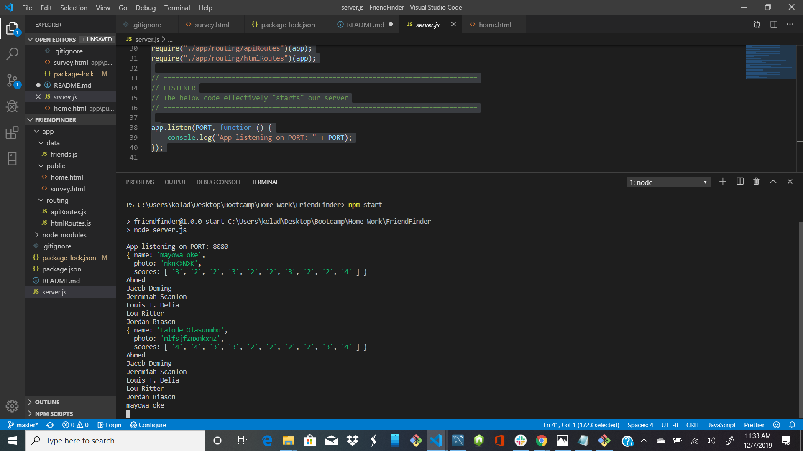
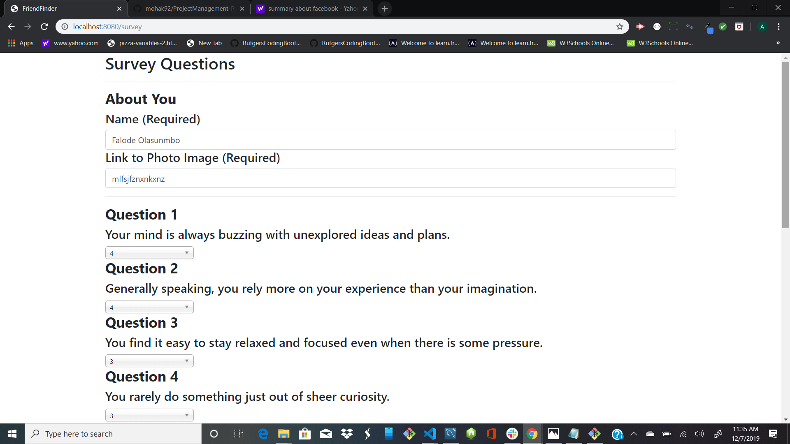
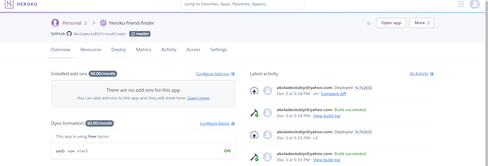

# FriendFinder

## Background
 This is a social networking site and hopefully it will soon be widely used to connect friends across the world. However, this app did not rule out negative and positive impacts to the society through influencing all the life aspects like political, social and economic. 

 The app is user's friendly and takes in results from your users' surveys, then compare their answers with those from other users. The app will then display the name and picture of the user with the best overall match.

 1. To get our server listening on local host, we type "nmp start" in our terminal.
 2. This will take us to the browser page where our home page is displayed.
 3. Below are some pictures to show us what our output is likely to be.

